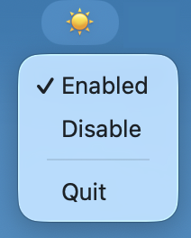

# Stay Awake (macOS Keep Awake)

Lightweight menu bar app that prevents your Mac from sleeping or displaying the screensaver.



## Download (recommended)

[Download Stay Awake.dmg](https://github.com/volodymyr-kryvoshapov/stay-awake/raw/main/dist/Stay%20Awake.dmg)

1. Download the DMG
2. Open the DMG (double-click)
3. Drag "Stay Awake" to the Applications folder
4. Launch from Applications or Spotlight (⌘ Space)
5. Grant Accessibility permission when prompted

**Note:** If you see a security warning:
- Right-click the app → "Open" → "Open" again in the dialog
- Or go to System Settings → Privacy & Security → "Open Anyway"

## How It Works

Stay Awake uses two complementary mechanisms to keep your Mac awake:

1. **`caffeinate -d -i`** - Prevents system sleep and display sleep while the app runs
2. **HID-level mouse movements** - Periodically moves the mouse cursor by 1 pixel to reset the idle timer, preventing screensaver and MDM lock screens

The app starts **enabled by default** when launched, showing a ☀️ icon in the menu bar. Click the menu item to toggle between:
- **☀️ (Awake)** - Mouse jiggling and caffeinate active
- **😴 (Idle)** - Both disabled, system can sleep normally

## Menu Bar Icons

- **☀️** - App is enabled, keeping your Mac awake
- **😴** - App is disabled, Mac can sleep normally

## Requirements

- macOS 13+ recommended
- Python 3.9+ (Homebrew Python preferred)

## Build from source (optional)

1. Install Python (Homebrew recommended):

```sh
brew install python
```

2. From this project folder, run:

```sh
make run
```

This creates a virtual environment, installs dependencies, and starts the app.

## Build .app bundle

```sh
make build
```

This creates a DMG installer at `dist/Stay Awake.dmg` containing the macOS app bundle.

## Install from local DMG (if you built it)

1. Download `Stay Awake.dmg`
2. Open the DMG (double-click)
3. Drag "Stay Awake" to the Applications folder
4. Launch from Applications or Spotlight (⌘ Space)
5. Grant Accessibility permission when prompted

To quit the app, use the menu bar item and click Quit.

## Accessibility permission (required)

To allow synthetic mouse events, grant Accessibility access:

**System Settings → Privacy & Security → Accessibility**

- If running from Terminal: enable access for Terminal (or iTerm2)
- If running the bundled app: enable access for "Stay Awake"

Without this permission, the mouse jiggle will not work and your Mac may still lock.

## Useful commands

```sh
make venv     # create virtual environment
make install  # install dependencies
make run      # run the app
make build    # build .app via py2app
make verify   # show power management assertions
make clean    # remove venv and build artifacts
```

## Verify it is working

```sh
make verify
```

Look for `PreventUserIdleDisplaySleep` while the app is enabled.
